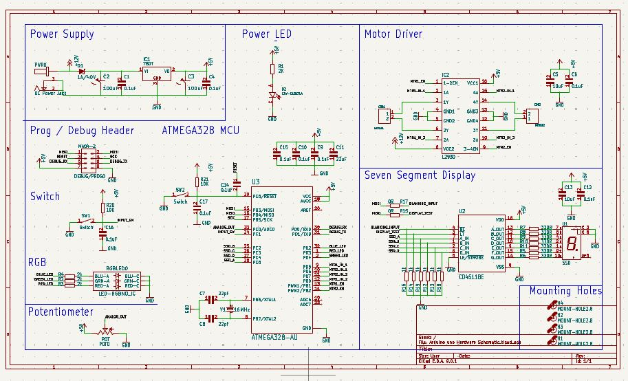
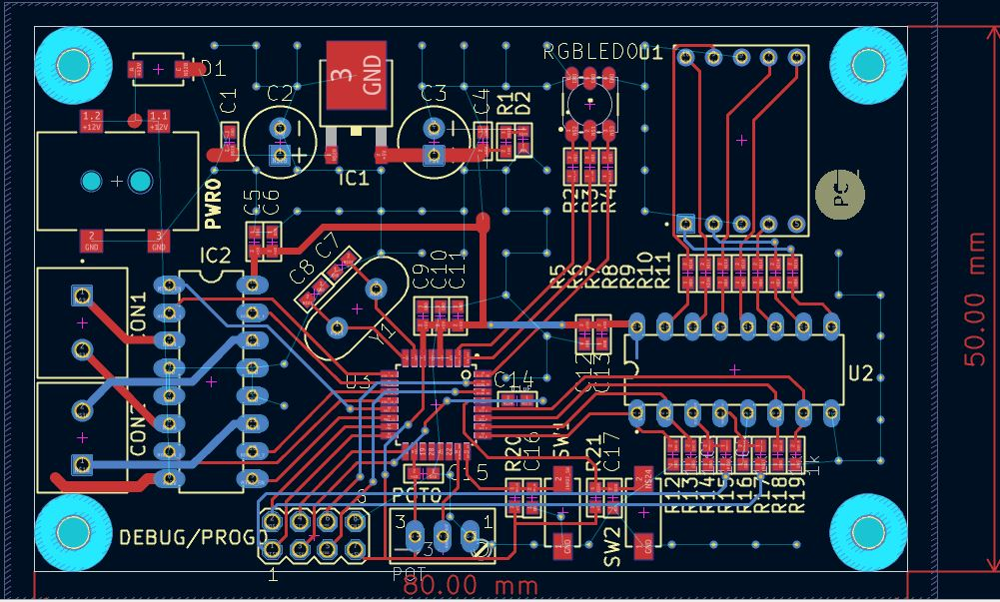
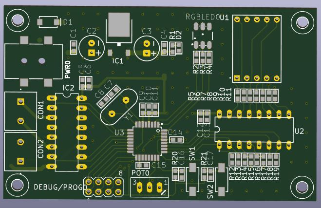
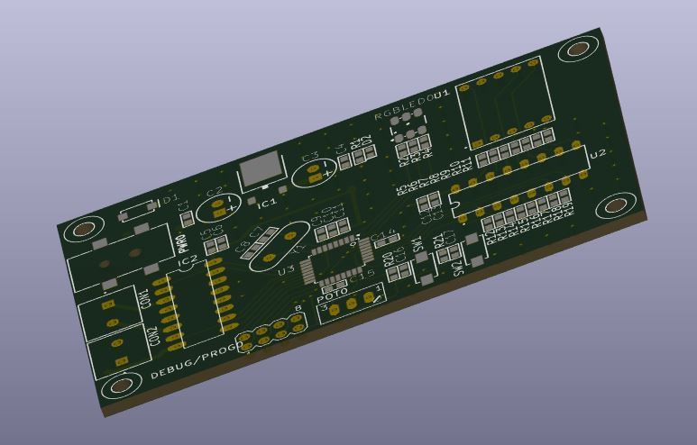
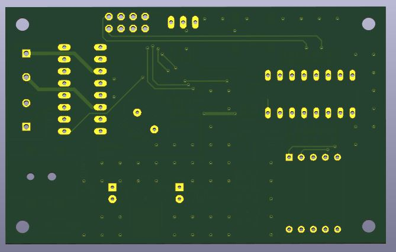

#  Custom Arduino Uno Compatible PCB 

##  Overview

This project is a custom-designed Arduino Uno compatible PCB developed using KiCad. The design is based on the ATmega328P microcontroller and integrates multiple hardware modules such as motor driver, 
seven segment display, RGB LED, and user input components into a single compact board.

The goal of this project is to create a multifunctional embedded system board that extends the capabilities of a standard Arduino Uno by integrating additional peripherals directly on the PCB.

---

##  Objectives

* Design a complete Arduino-compatible PCB from scratch
* Integrate multiple modules into a single hardware platform
* Learn PCB routing, power distribution, and component placement
* Gain practical experience in embedded hardware design

---

##  Key Features

* ATmega328P microcontroller (main controller)
* On-board 5V regulated power supply using 7805
* Motor driver interface (L293D) for DC motor control
* Seven segment display driver (CD4511)
* RGB LED module for visual output
* Push button switches for user input
* Potentiometer for analog input
* ISP debug/programming header
* Compact PCB with organized routing and labeling

---

##  Functional Blocks

###  Power Supply Section

* DC input via power connector
* Reverse polarity protection diode
* 7805 voltage regulator for stable 5V output
* Filtering capacitors for noise reduction

---

###  Microcontroller Unit (ATmega328P)

* Central processing unit of the board
* External crystal oscillator for clock stability
* Decoupling capacitors for noise suppression
* Connected to all peripheral modules

---

###  Motor Driver Section

* L293D motor driver IC
* Supports control of DC motors
* Controlled via microcontroller digital pins

---

###  Seven Segment Display Section

* CD4511 BCD to 7-segment decoder
* Connected to MCU for numeric display output
* Current limiting resistors used for segment protection

---

###  RGB LED Module

* RGB LED with individual control lines
* Resistors for current limiting
* Can be controlled using PWM signals

---

###  Input Controls

* Push button switches for digital input
* Potentiometer connected to analog input (ADC)
* Useful for testing user interaction

---

###  Debug / Programming Header

* ISP header for programming ATmega328P
* Supports bootloader burning and firmware upload

---

##  Project Preview

###  Schematic Design

###  PCB Routing Layout

###  3D View

---

##  PCB Specifications

* Board Size: ~80mm × 50mm
* Mounting Holes: 4 (for enclosure support)
* Through-hole + SMD mixed design
* Clearly labeled silkscreen for easy debugging

---

##  Components Used

| Component          | Description            |
| ------------------ | ---------------------- |
| ATmega328P         | Main microcontroller   |
| 7805               | 5V voltage regulator   |
| L293D              | Motor driver IC        |
| CD4511             | 7-segment decoder      |
| Crystal Oscillator | Clock source           |
| Capacitors         | Filtering & decoupling |
| Resistors          | Current limiting       |
| RGB LED            | Visual output          |
| Push Buttons       | User input             |
| Potentiometer      | Analog input           |
| Connectors         | Power & I/O            |

---

##  Tools Used

* KiCad (Schematic + PCB Design)

---

##  Important Notes

* This is a **custom Arduino-compatible board**, not an official Arduino product
* Ensure correct power input (avoid over-voltage)
* Verify component orientation before powering the board
* Suitable for educational and prototyping purposes

---

##  Future Improvements

* Add USB-to-Serial interface (CH340 / FT232)
* Add onboard voltage regulator alternatives (switching regulator)
* Improve grounding with full ground plane
* Optimize routing for high-current paths
* Add protection circuits (fuse, reverse polarity protection)

---

##  Files Included

* `.kicad_pro` → Project configuration
* `.kicad_sch` → Schematic design
* `.kicad_pcb` → PCB layout

---

##  Learning Outcomes

This project demonstrates:

* Embedded system hardware design
* Multi-module PCB integration
* Power supply design
* Signal routing and layout optimization
* Practical use of KiCad for real-world projects

---
